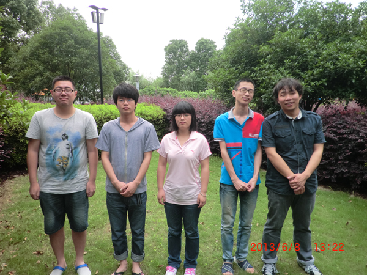
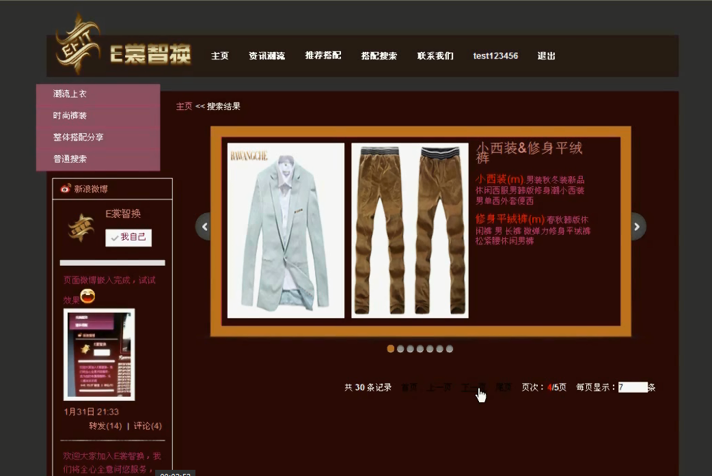
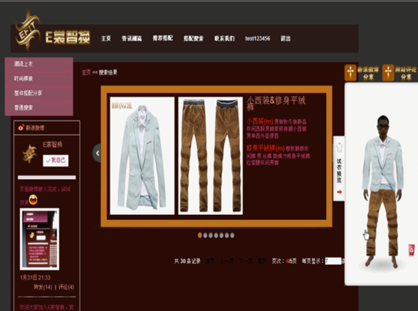
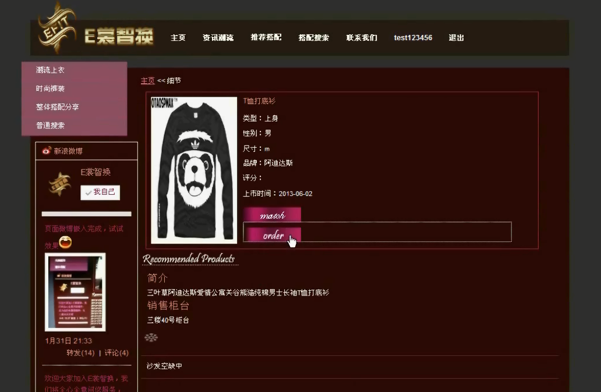
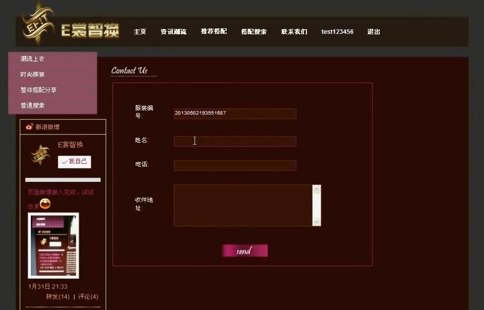
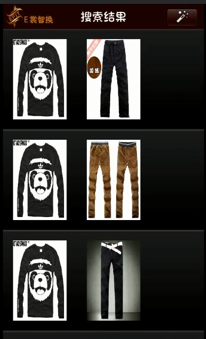

# Medium_04_EFIT
2013 年浙江省服务外包创新应用大赛二等奖作品

# 关于
## E裳智换智能选衣系统
宁波大红鹰学院   EFIT团队

池超凡、张雨刚、陆文俊、张振宇、朱冬梅

指导教师：李晓蕾

随着生活水平的提高，大家的追求逐渐从物质转移到精神层面上，服装搭配就是其中一种，而快节奏的生活，让我们没有时间和精力不断的试穿衣服，且试衣间有限，经常出现时间浪费在等待试衣间空闲上的现象。为了解决节省时间和空间的服装搭配问题，我们需要开发这样一款软件：它能自动的搭配出适合顾客的服装，且不需要顾客自己一套一套的试穿，就能得到自己想要的服装。

**一、目标问题**

1) 如何快速自动搭配出令顾客满意的服装；

2) 如何实现顾客之间的交流，以此推广本系统，达到对商场的宣传效果；

3) 如何实现服装的二维试穿效果；

4) 如何确保快速准确的搜索到服装在商场中的位置；

5) 如何获取服装赠送对象的头像；

**二、解决思路**

建立全新的服装销售模式，实现顾客-商场-商家三方友好的协作模式，改变传统的业务模式。商家更新服装，商场提供服装智能搭配平台，顾客只需动动手，即可为自己和他人选购到称心如意的服装，从而节省了顾客在选购服装时所花费的时间，同时也无须去等待紧缺的试衣间进行试衣。此外，商场提供的送货至家服务，加大顾客对商场的满意度，无形中宣传了商场，从而吸引更多的顾客，增加客流量，使商家的利润攀升。

**三、实现过程**

**1、团队简介：**EFIT团队由5人组成，分别是张振宇、张雨刚、朱冬梅、池超凡和陆文俊。张振宇、池超凡、张雨刚为技术人员，主要负责代码编写，陆文俊主要负责前台页面和视频等的制作，朱冬梅、张雨刚负责文档的撰写。开发团队如下图所示。

**2、具体做法：**

* 服装自动搭配：采用数据挖掘和信息匹配技术，使输入的服装信息与数据库中的服装数据进行匹配，自动搭配出服装，达到快速自动搭配出令顾客满意的服装的目的。

* 二维试穿效果：采用信息匹配和图片处理技术，通过摄像头获取顾客头像，并与系统根据身体上、下身的尺寸而自动生成的身材模型进行组合，从而实现在线试衣功能，达到二维试穿效果。

* 手机端服装选购：手机端实现顾客为他人选购合心意且合身的服装，顾客通过与对方手机视频，从视频中获取对方的头像轮廓，并通过顾客输入的身体尺寸和对方的头像，形成人体模型组合，并通过试穿效果选购赠送的服装。

* 技术方面：服务器方面主要利用j2ee技术，用Struts框架基础架构，结合JSP，actionfrom和action实现数据的表现层，iBATIS负责数据持久层，jquery 负责数据显示层。利用ajax支持异步请求及高响应的特点，将数据以及操作呈现给客户，提高用户体验，降低开发者的难度，并减小开发周期。

**四、主要特色**

1) 自动搭配服装：通过数据匹配算法，设定一个匹配值，根据顾客输入的身材与关键字，从数据库中找出匹配值最近的服装。如下图所示。

2) 在线试衣：通过摄像头获取用户头像信息，与根据顾客输入的身材信息系统自动生成的身材模型进行组合，展示顾客的试穿效果，节省顾客试衣时间。如下图所示。

3) 服装定位：根据顾客所选的服装，提取数据库中此服装存放位置的值并显示，顾客根据显示快速找到商铺，并购买此服装，节省了寻找服装的时间。如下图所示。

4) 送货上门：根据顾客填写的地址信息，商场派送服装到相应地址，使顾客更加轻松的逛商场。如下图所示。

5) 手机客户端：顾客只要安装了手机客户端的系统，就能随时随地的选购商场的服装，选购后，前往商场付款、查看服装的质量即可，此外通过手机端可为他人选购合身、合心意的服装。如下图所示。

